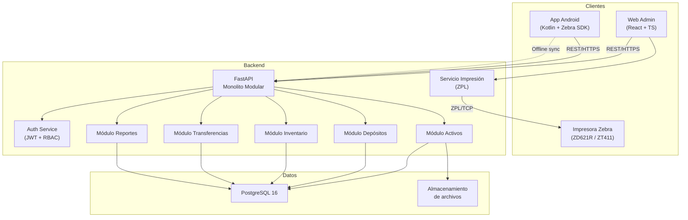
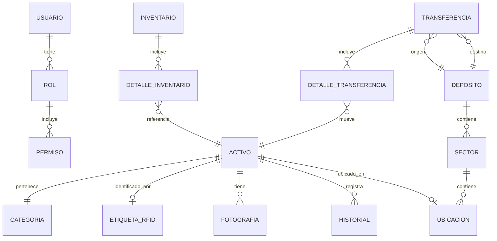

# Arquitectura del Sistema — Don Nicolás RFID

> Versión: 1.0 | Fecha: 2026-08-28

## 1. Visión general

Sistema de tres capas con backend monolítico modular, frontend web administrativo y aplicación móvil nativa Android para operaciones de campo con hardware Zebra.

## 2. Diagrama de componentes



## 3. Módulos del backend

Cada módulo sigue la estructura:

```
modulo/
├── router.py      # Endpoints HTTP
├── schemas.py     # Modelos Pydantic (request/response)
├── service.py     # Lógica de negocio
├── repository.py  # Acceso a datos (SQLAlchemy)
└── models.py      # Modelos ORM
```

### 3.1 Módulo Activos (`assets`)

- CRUD de activos con validaciones de negocio
- Gestión de categorías
- Upload de fotografías
- Asociación EPC/TID de etiqueta RFID
- Registro de historial/auditoría

### 3.2 Módulo Depósitos (`warehouses`)

- Jerarquía: Depósito → Sector → Ubicación
- Asignación de activos a ubicaciones
- Consulta de stock con filtros

### 3.3 Módulo Inventario (`inventory`)

- Creación de sesiones de inventario
- Registro de lecturas RFID (esperado vs encontrado)
- Cálculo de discrepancias (faltantes/sobrantes)
- Cierre y confirmación de inventario

### 3.4 Módulo Transferencias (`transfers`)

- Creación de órdenes de transferencia
- Confirmación por lectura RFID en origen y destino
- Historial de movimientos con trazabilidad

### 3.5 Módulo Usuarios (`auth`)

- Registro y autenticación (JWT)
- Roles: `admin`, `operador_deposito`, `operador_alta`, `supervisor`
- Permisos granulares por módulo/acción

### 3.6 Módulo Reportes (`reports`)

- Dashboard: stock total, movimientos recientes, discrepancias
- Exportación PDF/Excel
- Filtros por fecha, depósito, categoría

## 4. Modelo de datos (simplificado)



## 5. Flujos principales

### 5.1 Alta de activo con impresión RFID

```
Operador → Web: Completa formulario de activo
         → API: POST /api/v1/assets
         → API: Genera EPC único
         → Servicio ZPL: Envía comando a impresora
         → Impresora: Imprime y codifica etiqueta
         → API: Confirma EPC asociado al activo
         → DB: Persiste activo + historial
```

### 5.2 Inventario masivo (móvil)

```
Operador → App: Selecciona depósito/sector
         → API: GET stock esperado del área
         → App: Inicia lectura RFID (Zebra SDK)
         → App: Compara leídos vs esperados
         → App: Muestra faltantes/sobrantes
         → App → API: POST /api/v1/inventory (sync)
         → DB: Registra inventario + discrepancias
```

### 5.3 Transferencia entre depósitos

```
Operador → App: Crea transferencia (origen → destino)
         → App: Lee tags RFID de activos a transferir
         → API: Valida activos en depósito origen
         → API: Registra transferencia pendiente
         → Operador en destino: Confirma lectura RFID
         → API: Actualiza ubicaciones de activos
         → DB: Historial de movimiento completo
```

## 6. Sincronización offline (móvil)

```
┌─────────────┐         ┌──────────────┐
│  Room DB    │◄───────►│  Sync Queue  │
│  (local)    │         │  (pendientes)│
└──────┬──────┘         └──────┬───────┘
       │                       │
       │    Sin conexión       │
       │◄─────────────────────►│  Operaciones locales
       │                       │
       │    Con conexión       │
       └──────────────────────►│  POST batch a API
                               │  Resolución de conflictos
                               │  (last-write-wins + log)
```

**Estrategia de conflictos:** El servidor es fuente de verdad. Las operaciones offline se encolan con timestamp. Al sincronizar, si hay conflicto, se registra en log de auditoría y se notifica al operador.

## 7. Seguridad

| Aspecto | Implementación |
|---------|----------------|
| Transporte | HTTPS obligatorio (TLS 1.2+) |
| Autenticación | JWT con refresh tokens (access: 15min, refresh: 7d) |
| Autorización | RBAC middleware en cada endpoint |
| Contraseñas | bcrypt con salt |
| Archivos | Validación de tipo MIME, límite de tamaño |
| API | Rate limiting (100 req/min por usuario) |
| Auditoría | Log de acciones críticas en tabla `historial` |

## 8. Decisiones de arquitectura (ADRs)

Las decisiones técnicas relevantes se documentan en `docs/adr/` siguiendo el formato:

- **ADR-001:** Monolito modular vs microservicios → Monolito modular
- **ADR-002:** App nativa Android vs cross-platform → Nativa (SDK Zebra)
- **ADR-003:** PostgreSQL vs alternativas → PostgreSQL
- **ADR-004:** Offline-first con Room vs solo online → Offline-first
